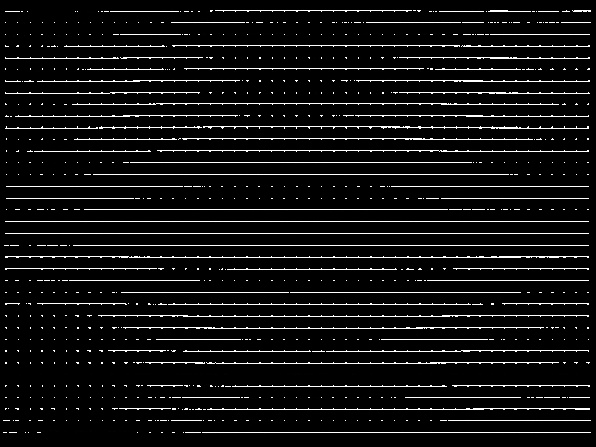
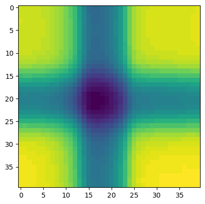

# Exact Dot Detection
Simply this study devoloped to detect dot's respect to pixel coordinates on any given photo. this methodology will be explained in this document. I ! am trying to explained by every step.


## Why didn't we use harris corner detection: 
at the beggining of this article we preffer to use harris corner detection first at the end of our researches corners are not available to use find exact dot. But towards to end of the project we can implament the harris corner dettection for purpose of to reach local area for each intersection points. this process will be disscuss on second documentary of project.

> __Cover the topic from these links :__ <br>
[Opencv Harris Corner Detection](https://docs.opencv.org/3.4/dc/d0d/tutorial_py_features_harris.html) <br>
[Wiki page](https://en.wikipedia.org/wiki/Harris_corner_detector)

## Collect the the image datas:
From now on ı will explain the topic from our original calibration image from blow...


To understand the general concept let me expain this images properties. This image has three layer called (R,G,B) if we want filter the lines first in first we need do decrease count of layer to one. 

After that in second phase what we like to do is convert this image form of binary. Thanks to this process we will collect an array which has 255 value and 0 values.

----
### __code of firts phase__

```python

#importing libraries...
import numpy as np
import pandas as pd
import cv2 
from scipy import special
import matplotlib.pyplot as plt


#collect the calibration image from source and convert it to gray scale...
original_image = cv2.imread("hyttest2.png")
original_array = np.array(original_image)
copy_array = original_array.copy()
copy_array = cv2.cvtColor(copy_array , cv2.COLOR_BGR2GRAY)

#print original image
plt.imshow(original_image)
plt.title("original image view")
plt.show()

#threshold convert it to binary image
def thresholder(original_array):
    gray_image = cv2.cvtColor(original_array , cv2.COLOR_BGR2GRAY)
    gray_image = cv2.medianBlur(gray_image,1)
    
    #plt.imshow(gray_image)
    avarage = gray_image.mean(axis = (0,1))-(gray_image.mean(axis = (0,1))/7.5)
    
    rat1 , threshold_img = cv2.threshold(gray_image , avarage , 255 , cv2.THRESH_BINARY)
    return threshold_img


```

As you can see from above we define a thresholder function. This function will be used as local manupulation proccess. Thanks to our previous researches direct threshold method failed. 


as you can see from above the corners of image has non-homogeneus intensity distrubition. In this situation binary conversion failed.

__So how we will approach to this problem...__

we will split into pieces our images and repeat all of conversion process for each of pieces. To collect equal spaces we need common divisor's of __x-axis__ and __y-axis__.

let's code it... 

```python
y = np.array([[0,162],[162,324],[324,486],[486,648],[648,810],[810,972],[972,1134],[1134,1296],[1296,1458],[1458,1620],[1620,1782],[1782,1944],[1944,2106],[2106,2268],[2268,2430],[2430,2592]])
x = np.array([[0,162],[162,324],[324,486],[486,648],[648,810],[810,972],[972,1134],[1134,1296],[1296,1458],[1458,1620],[1620,1782],[1782,1944]])

for i in range(len(x)):
    for j in range(len(y)):
        array = original_array[x[i , 0] : x[i , 1] , y[j , 0] : y[j , 1]]
        copy_array[x[i , 0] : x[i , 1] , y[j , 0] : y[j , 1]] = thresholder(array)


plt.imshow(copy_array)
plt.show()

```

## BW image

>Referaces for threshold and conversion process.<br>[1] https://docs.opencv.org/3.4/d7/d4d/tutorial_py_thresholding.html <br> <br> [2] https://docs.opencv.org/3.2.0/d7/d4d/tutorial_py_thresholding.html <br> <br>
[3] https://docs.opencv.org/2.4.13.7/doc/tutorials/imgproc/threshold/threshold.html#threshold-binary


```python
mask = (copy_array > 200)
mask2 = (copy_array < 100)

copy_array[mask]  = 0
copy_array[mask2] = 255

plt.imsave("BW_image.jpeg" , copy_array)

plt.imshow(copy_array)
plt.show()

```
------
## Segmantation of lines respect to X & Y

for this we want to create two diffrent array. One of the is for "x" values and the other one holds "y" values.

This arrays need's to be same shape with our original image.

```python
x_lines = np.zeros(shape = (1944 , 2592))
y_lines = np.zeros(shape = (1944 , 2592))
```


then let's segmetate x lines. 

```python


for i in range(1944):
    print(f"{i},     {np.count_nonzero(copy_array[i , :])}")
    filter_line = (np.count_nonzero(copy_array[i , :]) > 1000)
    if filter_line == True:  
        second_filter = (copy_array[i , :] > 250)
        x_lines[i , :][second_filter] = 255
    else:
        continue


plt.imshow(x_lines)
plt.show()
```


Same method for y lines...
```python
for i in range(2592):
    print(f"{i},     {np.count_nonzero(copy_array[: , i])}")
    filter_line = (np.count_nonzero(copy_array[: , i]) > 700)
    if filter_line == True:  
        second_filter = (copy_array[: , i] > 200)
        y_lines[: , i][second_filter] = 255
    else:
        continue
```



----

At the end we will overlape these array what we expected to reach is simple...

higest Intensitys will be our exact dot regions...

```python
import matplotlib.pyplot as plt

mesh_arrays = np.array((x_lines/255 + y_lines/255))
plt.imshow(mesh_arrays)
plt.show()
print(np.max(mesh_arrays))

mesh_array_filter = (mesh_arrays > 1)
#filtered_dots = (mesh_arrays[mesh_array_filter])


np.max(mesh_array_filter)
#plt.imshow(filtered_dots)
#plt.show()

mesh_arrays[mesh_array_filter] = 255
mesh_arrays[np.invert(mesh_array_filter)] = 0

# save image
plt.imsave("mesh_Arrays.jpeg",mesh_arrays)
```


## Filter and reach Intersection point's local areas. 

```python

# bring image
img = cv2.imread("mesh_Arrays.jpeg")
gray = cv2.cvtColor(img , cv2.COLOR_BGR2GRAY)
plt.imshow(gray)
plt.show()

# shape control
shape = np.shape(gray)
print(f"shape of image:\n {shape}")


l1 = [] # Intensity > 140
l2 = []
l3 = list(gray)
l4 =[]

# filtering all dot_groups

for i in range(shape[0]):
    for j in range(shape[1]):
        control = (gray[i,j] > 140)
        if control == True:
            l1.append([i,j])


# filtering respect to distance
l2 = l1.copy()
index = 1

for i in l1:
      
    if  index == len(l1):
        break
    
    
    distance = np.sqrt((i[0] - l1[index][0])**2 + (i[1] - l1[index][1])**2)
    index += 1 
    print(distance)
    if distance > 30:
        l4.append(i)
    else:
        continue


#filterin2 respect to distance
l5 = np.array(l4)


l6 = []
l6.append([l4[0]])
for i in range(len(l4)):
    distance = l4[i][0] -l6[-1][0][0] 
    if distance == 0: 
        l6.append([l4[i]])
    if distance > 10:
        l6.append([l4[i]])


# creating new image for local centers of filtered areas.
blank_img = np.zeros(np.shape(gray))


for i in l6:
    print(i[0])
    blank_img[i[0][0],i[0][1]] = 200
    #print("it's done")


# save image
plt.imsave("blank_img.jpeg",blank_img)


```


## Given code below is not done yet. But it can reaches expected areas. we will cover this code on second phase.

```python
for i in l6:
    rangex_min = i[0][0] - 20
    rangex_max = i[0][0] + 20
    
    rangey_min = i[0][1] - 20
    rangey_max = i[0][1] + 20
        
    region = original_img[rangex_min : rangex_max , rangey_min : rangey_max]
    
    Highest_I = np.transpose(np.where(region == np.min(region)))
    mid = np.floor(len(Highest_I)/2)
    potision = Highest_I[int(mid)]
    
    
    #implament blank dot
    blank_dot[rangex_min : rangex_max , rangey_min : rangey_max][potision[0] , potision[1]] = 255
    
    
    
    
    
    #plt.imshow(region)
    #plt.show()
```
## Local area example:

<br>



